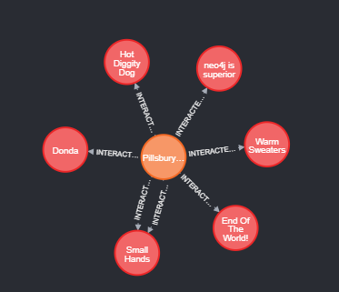
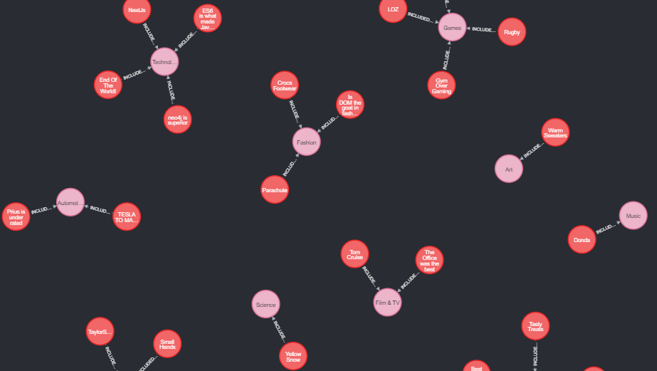
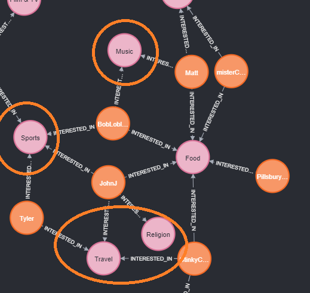
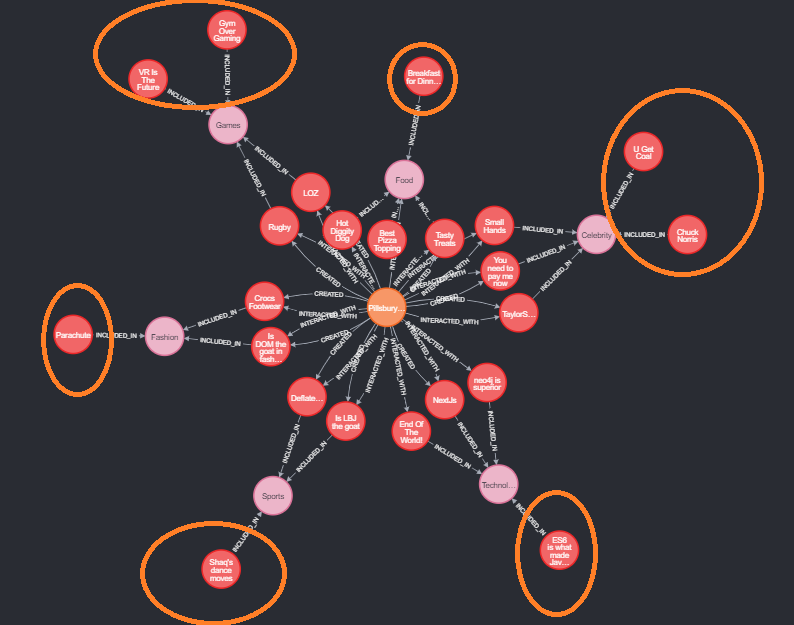

# Insights from the Data

How user data can be visualized to find patterns and make discoveries.

While this project is not explicitly about analyzing data, it is important to the client that this app was created for be able to derive insights from the user information.

Below are a few examples to demonstrate the possible Cypher queries that can be made against the Neo4j graph database.

---

## Example Cypher Queries

### Find posts a user interacted with



```SQL
MATCH
  (u:User {email: "pillsbury.doughboy@gmail.com"}),
  (u)-[:INTERACTED_WITH]->(p:Post)
WHERE NOT
  (u)-[:CREATED]->(p)
RETURN
  u, p
```

### Display all Posts per each Category



```SQL
MATCH
  (c)-[:INCLUDED_IN]->(p)
RETURN
  c, p
```

### Display All Users Interests

Suggest Categories that other users with similar interests are interested in



```SQL
MATCH
    (u)-[:INTERESTED_IN]->(c:Category)
RETURN
    u, c
```

### Find Posts a user may like

Suggest based on interactions with Posts in the same category as Posts interacted with



```SQL
MATCH
    (u {email: "pillsbury.doughboy@gmail.com"})-[*1..2]->(c:Category),
    (c)-[:INCLUDED_IN]-(p:Post)
WHERE NOT
    (u)-[:INTERACTED_WITH]->(p)
RETURN
    p
```
